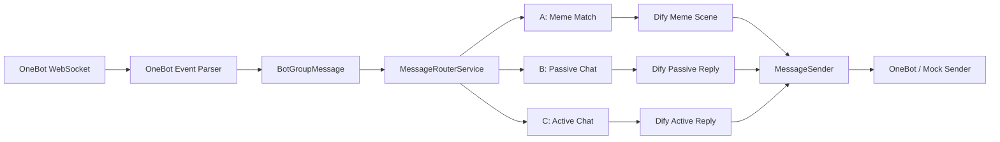

# QQ 群 AI 表情包与群聊知识机器人

一个基于 Spring Boot、OneBot v11 WebSocket、Dify、MySQL、Redis 和 Vue 3 的 QQ 群 AI 机器人项目。

项目目标不是简单调用大模型聊天，而是围绕真实 QQ 群场景实现一套可控、可诊断、可灰度的 AI 应用后端：群消息接入、消息路由、表情包场景识别、被动 AI 对话、主动插话、群配置控制、聊天历史数据处理、知识库召回和本地运维控制台。

> 本项目用于个人学习、后端工程实践和 AI Agent 应用落地探索。仓库不包含真实 QQ 账号、SnowLuma token、Dify API Key 或真实群聊隐私数据。

## 功能概览

- OneBot v11 WebSocket 接入：支持 SnowLuma / OneBot 真实群消息收包与文字、图片发送。
- 统一消息路由：消息去重、群配置读取、总开关判断、管理员指令、安全词、A/B/C 通路分发。
- 表情包通路 A：关键词匹配 + Dify 语义场景识别 + scene_dict / meme_material 素材选择。
- 被动聊天通路 B：支持 `@机器人` 或昵称触发，加载群级人设和 Redis 热层上下文，调用 Dify 生成回复。
- 主动插话通路 C：通过冷却、小时上限、每日上限、概率和 Dify 判断控制低频主动发言。
- 群配置灰度控制：按群开关表情包、被动聊天、主动插话、知识库上下文等能力。
- 管理员运维能力：群内命令、私聊控制命令、管理员操作日志和触发日志。
- 表情包素材管理：维护场景、关键词、权重、启用状态、图片相对路径，支持本地图片上传和路径巡检。
- 群聊历史数据处理：导入 NapCat-QCE JSON，清洗 raw / clean message，生成会话、回复、@、成员统计。
- 知识库流程：候选群梗、候选成员画像、人工审核、正式知识发布、embedding 生成和受控 knowledgeContext 召回。
- 本地 Admin UI：提供群配置、表情包素材、知识审批、聊天流水线、成员排行、消息模拟、日志诊断和运行配置页面。

## 技术栈

| 模块 | 技术 |
| --- | --- |
| 后端 | Java 17, Spring Boot, MyBatis-Plus, Maven |
| 数据库 / 缓存 | MySQL 8, Redis |
| AI 工作流 | Dify Workflow, LLM, RAG / knowledgeContext |
| QQ 接入 | OneBot v11, WebSocket, SnowLuma |
| 前端控制台 | Vue 3, Vite, TypeScript, Element Plus |
| 工程工具 | Docker Compose, Git, Apifox |

## 核心路由

真实群消息进入后端后，会被转换成内部统一消息 DTO，再进入 `MessageRouterService`：

```text
去重
-> 群配置读取
-> 群总开关判断
-> 管理员指令 / 安全词
-> 被动聊天 B
-> 表情包 A
-> 主动插话 C
-> 静默
```



## 项目结构

```text
.
├── admin-ui/                 # Vue 3 本地运维控制台
├── docs/                     # 阶段文档、联调说明、运维说明
├── memes/                    # 本地表情包基础目录，只提交 README / .gitkeep
├── scripts/                  # 本地真实联调启动脚本和 env 示例
├── src/main/java/com/yh/qqbot
│   ├── adapter/              # OneBot、dev/admin API 适配层
│   ├── chat/history/         # 群聊历史导入、清洗、知识库、向量检索
│   ├── config/               # 配置与启动迁移
│   ├── router/               # 消息路由主干
│   ├── service/              # 表情包、聊天、命令、上下文、日志等业务服务
│   └── dto/entity/mapper     # DTO、实体和 MyBatis-Plus Mapper
└── src/main/resources
    ├── application.yaml
    ├── application-dev.yaml
    ├── application-dify-example.yaml
    └── db/mysql/schema.sql
```

## 本地开发启动

### 1. 启动 MySQL 和 Redis

```powershell
docker compose -f docker-compose-dev.yaml up -d
```

该 compose 只启动 MySQL 8 和 Redis，不包含 Dify、NapCat 或 SnowLuma。

### 2. 启动后端 dev profile

```powershell
.\mvnw.cmd spring-boot:run "-Dspring-boot.run.profiles=dev"
```

dev profile 默认行为：

- 使用本地 MySQL / Redis。
- 使用 `MockMessageSender`，不会真实发送 QQ 消息。
- `dify.enabled=false`，不会访问真实 Dify。
- 表情包缓存预热开启。
- OneBot WebSocket 默认不开启。

### 3. 打开本地控制台

如果已经构建过前端，可以直接访问 Spring Boot 托管页面：

```text
http://127.0.0.1:8081/admin/
```

前端独立开发：

```powershell
cd admin-ui
npm.cmd install --cache .\.npm-cache
npm.cmd run dev
```

访问：

```text
http://127.0.0.1:5173/admin/
```

## 真实 OneBot 联调

真实联调通过本地 env 文件配置，不要把真实 token 或 API Key 写入 Git。

```powershell
copy scripts\onebot-local.env.example scripts\onebot-local.env
```

编辑 `scripts\onebot-local.env` 后执行：

```powershell
.\scripts\run-onebot-local.ps1
```

脚本会读取 env 文件并启动 local profile。启动前只打印非敏感配置，例如 OneBot URL、selfId、allowedGroupIds、Dify enabled 和 workflow 名称，不会打印 SnowLuma token 或 Dify API Key。

详细说明见：

- [真实联调启动方式](docs/onebot-local-run.md)
- [dev 本地联调说明](docs/dev-run.md)

## Dify 工作流

项目按 A/B/C 三条通路拆分 Dify 工作流和 API Key：

| 通路 | Workflow | 用途 |
| --- | --- | --- |
| A | `meme-scene-recognizer` | 表情包语义场景识别 |
| B | `passive-chat-reply` | 被动聊天回复 |
| C | `active-chat-reply` | 主动插话判断与回复 |

环境变量示例：

```env
DIFY_ENABLED=true
DIFY_BASE_URL=https://api.dify.ai/v1
DIFY_MEME_SCENE_API_KEY=app-your-meme-scene-key
DIFY_PASSIVE_CHAT_API_KEY=app-your-passive-chat-key
DIFY_ACTIVE_CHAT_API_KEY=app-your-active-chat-key
DIFY_MEME_SCENE_WORKFLOW=meme-scene-recognizer
DIFY_PASSIVE_CHAT_WORKFLOW=passive-chat-reply
DIFY_ACTIVE_CHAT_WORKFLOW=active-chat-reply
```

真实 Key 只应放在本地 env 文件或运行环境变量中，不要提交到仓库。

## Admin UI 页面

当前本地控制台包含：

| 路径 | 功能 |
| --- | --- |
| `/admin/` | 项目总览与运行状态 |
| `/admin/groups` | 群配置工作台 |
| `/admin/memes` | 表情包素材管理、上传和路径巡检 |
| `/admin/knowledge` | 候选知识审批、正式知识库、embedding、召回预览 |
| `/admin/pipeline` | 聊天数据导入到知识发布流水线 |
| `/admin/insights` | 群聊统计趋势和多维洞察 |
| `/admin/member-rank` | 成员排行查询 |
| `/admin/simulate` | 群消息 / 私聊控制模拟 |
| `/admin/logs` | trigger_log / admin_op_log 诊断 |
| `/admin/settings` | 运行配置诊断 |
| `/admin/runbook` | 本地运维手册 |

更多说明见 [Admin UI 控制台](docs/admin-ui.md)。

## 表情包素材规范

表情包文件默认放在：

```text
memes/{sceneCode}/{sceneCode}_001.png
```

数据库中只保存相对路径：

```text
laugh/laugh_001.png
```

后端发送图片前会将相对路径解析为本地绝对路径，再转换成 OneBot 可识别的 `file:///C:/...` URI。

控制台 `/admin/memes` 支持选择文件上传，后端会自动按场景生成规范文件名，并回填到素材表单。真实图片文件默认被 `.gitignore` 忽略。

## 群聊历史与知识库流程

第十阶段数据链路：

```text
聊天记录 JSON 导入
-> raw message
-> clean message
-> 会话 / @ / 回复 / 成员统计
-> 候选群梗 / 候选成员画像
-> 人工审核
-> 正式知识库 / 正式成员画像
-> embedding
-> 知识召回
-> 受控 knowledgeContext
-> 灰度接入 A/B/C
```

知识库接入默认关闭，必须在指定群的 `group_config` 中显式开启：

- `enable_knowledge_context`
- `enable_meme_knowledge`
- `enable_passive_chat_knowledge`
- `enable_active_chat_knowledge`

主链路只使用审核通过、已发布、启用状态、embedding 成功的正式知识，不直接把原始聊天记录传给 Dify。

## 测试

后端测试：

```powershell
.\mvnw.cmd test
```

前端构建：

```powershell
cd admin-ui
npm.cmd run build
```

格式检查：

```powershell
git diff --check
```

## 安全说明

- 不提交真实 `.bot.json`。
- 不提交 `scripts/onebot-local.env`。
- 不提交 SnowLuma token。
- 不提交 Dify API Key。
- 不提交真实 QQ 账号敏感配置。
- 不提交完整群聊原始数据和隐私内容。
- `memes/` 下真实图片默认忽略，只保留目录规范说明和占位文件。

## 文档索引

- [dev 本地联调说明](docs/dev-run.md)
- [真实 OneBot 联调说明](docs/onebot-local-run.md)
- [Admin UI 控制台](docs/admin-ui.md)
- [私聊管理员控制模块](docs/private-admin-command.md)
- [Stage 09 灰度控制与管理员运维](docs/stage-09-gray-admin-ops.md)
- [Stage 10 聊天历史导入](docs/stage-10-chat-history-import.md)
- [Stage 10 候选知识与成员排行](docs/stage-10-member-rank.md)
- [Stage 10 正式知识库与向量检索](docs/stage-10-formal-knowledge-vector.md)
- [Stage 10 知识上下文灰度接入](docs/stage-10-knowledge-gray-route.md)

## 当前状态

项目已经完成本地 dev 联调、真实 OneBot WebSocket 联调、A/B/C Dify 工作流接入、群配置灰度控制、聊天历史数据处理、知识库召回和本地 Admin UI。后续可继续扩展前端可视化、更多管理员操作、知识库评估和更细粒度的真实群灰度策略。
